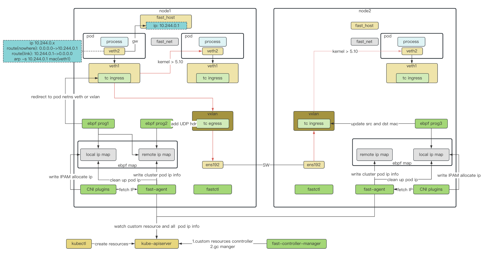

# Fast

Fast is a Kubernetes CNI based on eBPF implementation

## Architecture

Components:
+ fast-cni
  + implement CNI capabilities
  + access fast-agent fetch pod IP
+ fast-agent
  + obtain the cluster pod IP and store the information to the cluster eBPF map
  + the interface that implements IP allocation
  + create map and attach eBPF programs
+ fast-controller-manager
  + custom resources control
  + gc management to prevent IP leakage